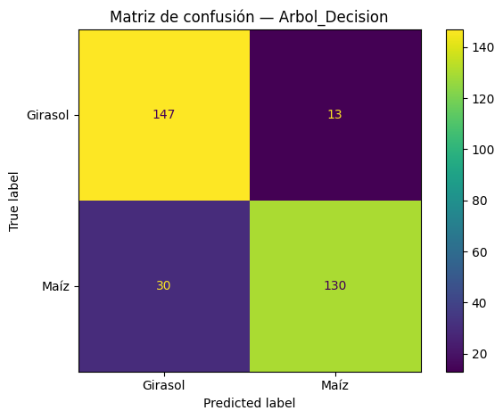

# Clase5-Clasificacion-Granos
Clase 5 — K-NN vs Árbol con Estimaciones Agrícolas (ARG). Split 80/20, F1-macro, matrices de confusión y gráficas para el informe

---

# K-NN vs Árbol de Decisión (Granos Argentina)

**Objetivo.** Comparar el desempeño de dos clasificadores (K-NN y Árbol de Decisión) para predecir el **cultivo** (Trigo, Maíz, Soja, Girasol, Cebada) usando datos reales de **Estimaciones Agrícolas (Argentina)**.
**Split:** 80/20 estratificado · **Métrica principal:** F1-macro · Métricas secundarias: F1-weighted y Accuracy.

---

## Dataset

* **Fuente:** Estimaciones Agrícolas — Ministerio de Agricultura (Argentina).
* **Archivo base del repo:** `estimaciones-agrícolas-2023-10.csv` (puede subirse en `data/` o referenciarse por URL oficial).
* **Variables utilizadas**

  * Categóricas: `campana` (ciclo), `provincia`, `departamento`
  * Numéricas: `superficie_sembrada_ha`, `superficie_cosechada_ha`, `produccion_tn`, `rendimiento_kg_ha`
  * **Target:** `cultivo`
* **Preprocesado:** normalización de nombres de columnas; ajuste de etiquetas (`Maiz → Maíz`); eliminación de filas con faltantes.
* *(Opcional para performance)*: submuestreo balanceado por clase.

---

## Metodología

1. **Codificación**: `pandas.get_dummies` para variables categóricas; numéricas sin transformar.
2. **Partición**: `train_test_split` 80/20 con `stratify=y`.
3. **Modelos**

   * **K-NN** en `Pipeline` con **MaxAbs/StandardScaler** (no centra; apto dummies).
   * **Árbol de Decisión** con control de complejidad (`max_depth`, `min_samples_leaf`, `max_features`).
4. **Tuning**: `GridSearchCV` (cv=3) con **`scoring="f1_macro"`**.
5. **Evaluación**: `classification_report` y **matrices de confusión**.

---

## Resultados (conjunto de test)

| Modelo                           |  F1-macro  | F1-weighted |  Accuracy  |
| -------------------------------- | :--------: | :---------: | :--------: |
| **Árbol de Decisión**            | **0.8514** |  **0.8514** | **0.8519** |
| K-NN (k=5, p=1, weights=uniform) |   0.7110   |    0.7110   |   0.7167   |

**Figuras (carpeta `figs/`):**

* Matrices de confusión:
   · 
* Árbol de decisión (resumen, 3 niveles):
  
  Árbol completo (anexo): ver `figs/arbol_completo.pdf`
* Curva de k (validación de K-NN):
  
* (Opcional) Fronteras 2D con PCA (solo ilustrativo):
  

---

## Análisis

* **Ganador:** el **Árbol de Decisión** supera a K-NN en F1-macro, F1-weighted y Accuracy.
* **Motivo:** las combinaciones categóricas de alta cardinalidad (provincia/departamento) generan fronteras no lineales que el árbol captura mejor. K-NN en espacios con muchas dummies sufre por la métrica de distancia.
* **Sobreajuste:** el árbol mostró mejor rendimiento en train que en test; se mitigó con `max_depth=15` y `min_samples_leaf=3`.

---

## Reproducibilidad

* **Notebook principal:** `Clase5_granos_knn_arbol.ipynb` (o el nombre que uses en el repo).
* **Requisitos:** Python 3.10+, `pandas`, `numpy`, `scikit-learn`, `matplotlib`.
* **Cómo correr**

  1. Abrir el notebook y ejecutar las celdas **de arriba hacia abajo**.
  2. Verificar rutas del CSV (si está en `data/` ajustar el path).
  3. Al final se generan las figuras en `figs/` y la tabla `resultados/resultados_clase5_granos.csv`.

---

## Limitaciones y mejoras

* Incluir más variables agroclimáticas (p. ej., precipitación y temperatura por campaña) y de suelos.
* Probar **`class_weight='balanced'`** en el árbol y otras métricas (macro-F1 por clase).
* Evaluar modelos adicionales (Random Forest, Gradient Boosting) y validación temporal por campañas.

---

## Créditos

Trabajo práctico de **Clase 5 — Aprendizaje Supervisado (Clasificación)**.
Datos: Estimaciones Agrícolas (Argentina).
Año: 2025.

